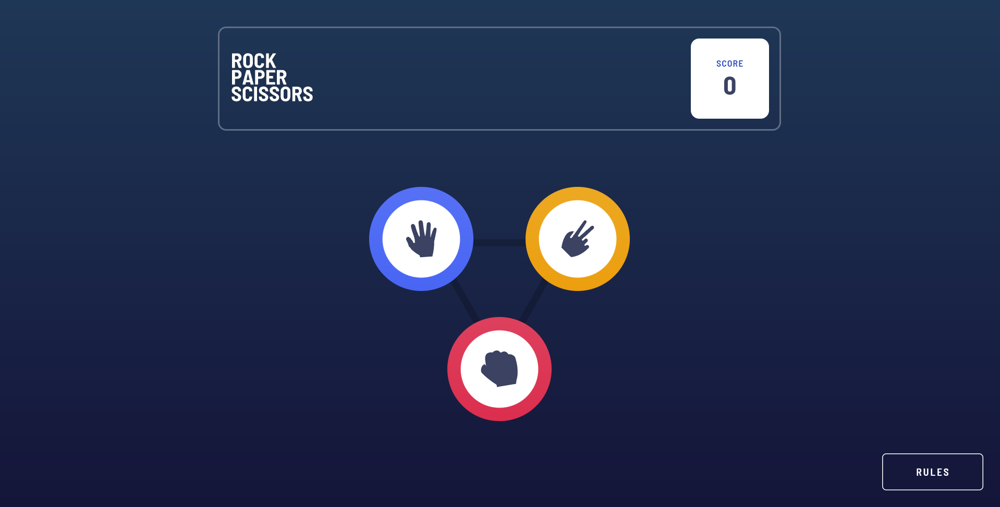
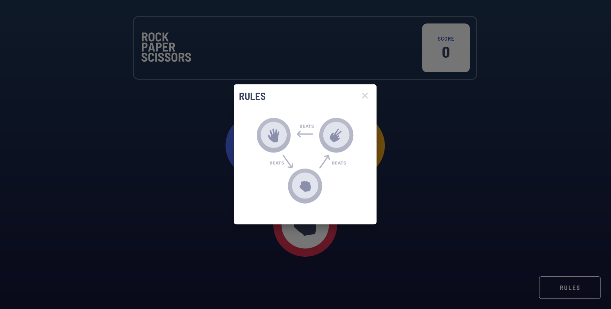
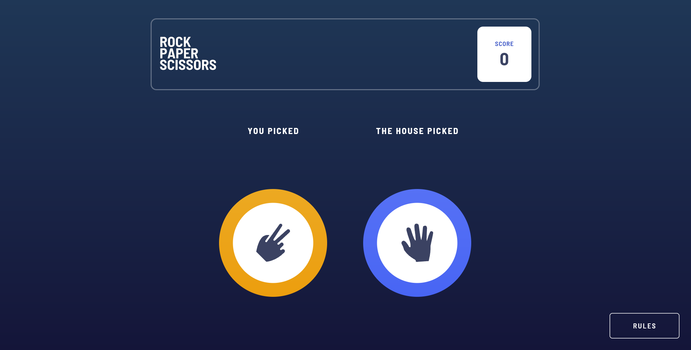
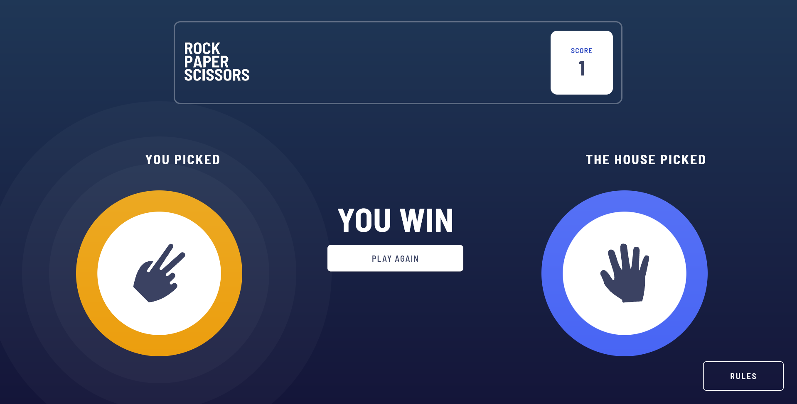
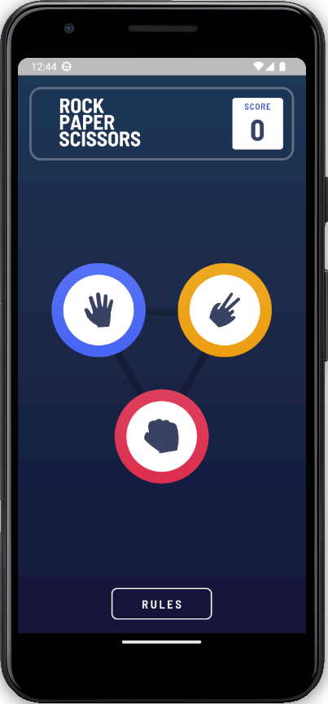
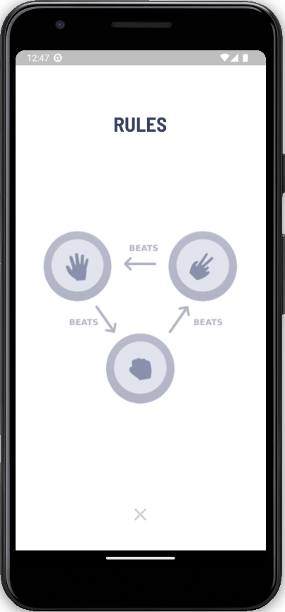
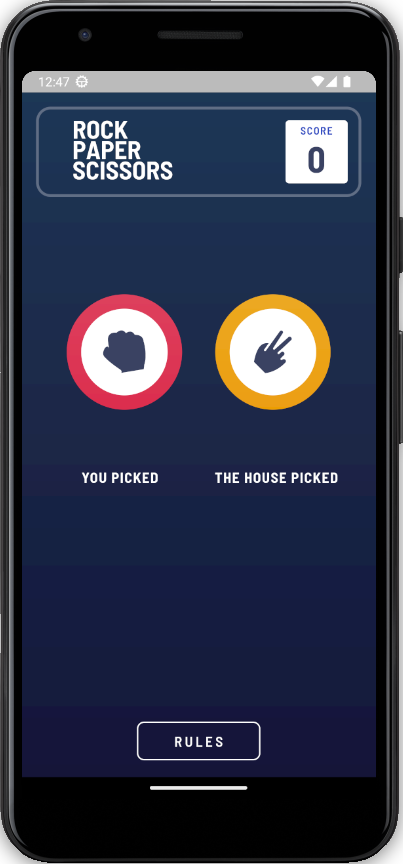
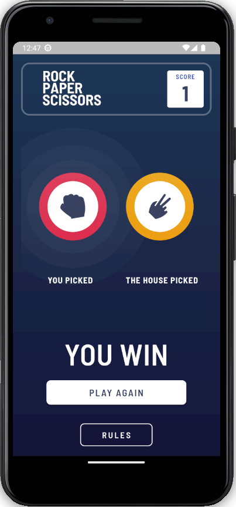

# Rock 👊 Paper ✋ Scissors ✌ Game

[Rock, Paper, Scissors](https://lucasmartins96.github.io/rock_paper_scissors_game/#/) é o famoso jogo de pedra, papel e tesoura, mas desenvolvido em Flutter.

Projeto desenvolvido como desafio de nível 4 (avançado) do Frontend Mentor. 


## Tabela de Conteúdos

   * [Demonstração Desktop](#Demonstração-Desktop)
   * [Demonstração mobile](#Demonstração-Mobile)
   * [Pré Requisitos](#Pré-Requisitos)
      * [Como executar a aplicação](#Como-executar-a-aplicação)
      * [Executando os testes](#Executando-os-testes)
   * [Tecnologias utilizadas](#Tecnologias-utilizadas)
   * [Autor](#Autor)

## Demonstração Desktop

- Página inicial



- Alerta de regras



- Exibição das escolhas



- Resultado




## Demonstração Mobile

- Página inicial



- Alerta de regras



- Exibição das escolhas



- Resultado




## Pré Requisitos

Antes de começar, você vai precisar ter instalado em sua máquina as seguintes ferramentas: [Git](https://git-scm.com/) e [Flutter](https://docs.flutter.dev/get-started/install).
Além disto é bom ter um editor para trabalhar com o código como [VSCode](https://code.visualstudio.com/).

Observações:

- Caso não tenha um ambiente preparado para executar em um emulador, o projeto pode ser executado no navegador.

## Como executar a aplicação

```bash
# Clone este repositório
$ git clone https://github.com/lucasmartins96/rock_paper_scissors_game.git

# Acesse a pasta do projeto no terminal/cmd
$ cd frontend_mentor_rock_paper_scissors

# Instale as dependências
$ flutter pub get

# Execute a aplicação
$ flutter run

# A aplicação irá iniciar no navegador
```


## Executando os testes

Para executar os testes, rode o seguinte comando no terminal (certifique-se que esteja na raiz da aplicação)

```bash
flutter test
```


## Tecnologias utilizadas

As seguintes ferramentas foram usadas na construção do projeto: 

- [Flutter](https://flutter.dev/)
- [Bloc](https://bloclibrary.dev/#/)


## Autor

- [@lucasmartins96](https://github.com/lucasmartins96)

